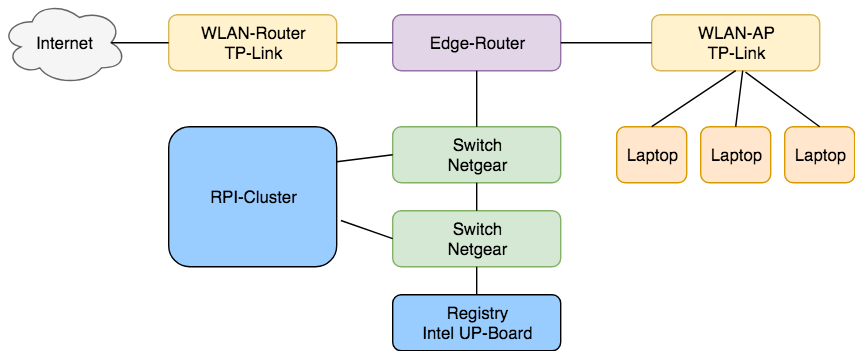

# Kubernetes-On-Embedded

Dies ist das Repo für unseren Blogpost https://bee42.com/de/blog/Kubernetes_Cluster_Embedded/, schaut mal rein!

_Achtung: Mit der Hypriot-Version 1.4.0 gab es einen schwerwiegenden Fehler: Die Machine-ID wurde nicht neu generiert und war deshalb bei allen RPI's identisch. Das führte zu [Problemen](https://stackoverflow.com/questions/49113253/kubernetes-pods-stuck-at-containercreating) mit dem Netzwerk-Layer!_




Wir bauen einen kompleten Kubernetes-Cluster auf Embedded-Hardware. Dazu benutzen wir einen EdgeRouterX, 2 WLAN-Router, 2 Switche, ein Intel UP-Board und für den eigentlichen K8S-Cluster Raspberry Pi's.


## Einkaufswagen füllen, bestellen, bezahlen, installieren und Spaß haben!

Alle Komponenten die Ihr braucht um einen Docker PI-Cluster aufzubauen können in der Regel preiswert und zuverlässig bestellt werden. Wir haben uns an der Liste von [Roland Huss](https://ro14nd.de/kubernetes-on-raspberry-pi3) orientiert:

Danke Roland :-)

Wir haben hier den aktuellsten RPI Modell 3B+ genommen, ein RPI 2 funktioniert aber auch, natürlich mit Abstrichen in der Leistung.

Stand 2018-05. ca. 244 Euro

| Anzahl | Teil                                                         | Preis      |
|:-------|:-------------------------------------------------------------|:-----------|
| 3      | [Raspberry Pi 3 B+](https://www.amazon.de/dp/B07BDR5PDW)     | 3 * 41 EUR |
| 3      | [Micro SD Card 32 GB](http://www.amazon.de/dp/B013UDL5RU)    | 3 * 12 EUR |
| 1      | [WLAN Router](http://www.amazon.de/dp/B00XPUIDFQ)            | 24 EUR     |
| 4      | [USB Kabel](http://www.amazon.de/dp/B016BEVNK4)              | 7 EUR      |
| 1      | [USB Stromgerät](http://www.amazon.de/dp/B00PTLSH9G)         | 30 EUR     |
| 1      | [Gehäuse](http://www.amazon.de/dp/B00NB1WPEE)                | 10 EUR     |
| 2      | [Zwischenplatten](http://www.amazon.de/dp/B00NB1WQZW)        | 2 * 7 EUR  |

* Option: Kühler für die PI kaufen und installieren


## SD-Karten für den beehive PI-Cluster vorbereiten

Es gibt mehrere Möglichkeiten ein RPi-Image auf eine SD-Karte zu bekommen. Wir nutzen für diesen Anwendungsfall das [Flash Tool der Hypriot Priraten](https://github.com/hypriot/flash). Als Basis der Installation verwenden wir das aktuelle [Hypriot OS](https://github.com/hypriot/image-builder-rpi/).

### Installation des Werkzeuges Flash unter Linux / OS X

Mit folgendem Befehlen installiert Ihr das Hypriot Flash Tool:

```
curl -O https://raw.githubusercontent.com/hypriot/flash/master/flash
chmod +x flash
sudo mv flash /usr/local/bin/flash
```

### Download des Hypriot OS-Images

Da Kubernetes offziel nur Docker CE bis 17.03 unterstützt, nehmen wir das Image V1.7.1 und (re-)installieren im weiteren Verlauf darauf Docker in der passenden Version:

```bash
mkdir OS-Images
cd OS-Images
HOS_VERSION=1.7.1
HOS_URL=https://github.com/hypriot/image-builder-rpi/releases/download
curl -LO ${HOS_URL}/v${HOS_VERSION}/hypriotos-rpi-v${HOS_VERSION}.img.zip
```

Entpacken des Images:

```bash
$ unzip hypriotos-rpi-v${HOS_VERSION}.img.zip
```

### Erstellen der Konfiguration `user-data.yml`

In dieser Datei können diverse Einstellungen vorgenommen werden, z.B. der zu vergebende Hostname, anzulegende User, oder, wie im folgenden Beispiel, SSH-Public-Keys für den passwortlosen Zugriff. Ein Beispiel findet Ihr im Repo.

### Flashen des OS-Images

Nach Erstellung der Datei `user-data.yml` könnt Ihr diese direkt mit auf die SD-Karte flashen. Ansonsten könnt ihr auch nach dem flashen die `user-data.yml` direkt auf dem PI bearbeiten.

```bash
$ flash -n "MY_HOSTNAME" -u "user-data.yml" hypriotos-rpi-v${HOS_VERSION}.img
```

## Raspberry-Pi starten

Nach dem Einsetzen der Karten könnt Ihr den Raspberry-PI starten. Nun könnt Ihr Euch zum Test mit dem PI per SSH verbinden.

```bash
$ ssh pirate@<ip>
```
__Frage__: Wie bekommt eigentlich heraus welche IP dem PI vom DHCP Server zugeordnet wurde?

```
# install nmap
$ brew install nmap
$ nmap -sn 192.168.1.0/24 # Durch Euer Netz ersetzen
```

Das Passwort für den Nutzer __pirate__ lautet: **hypriot**. 

Im Blog der Hypriot Piraten findet Ihr jede Mengen Erklärungen zum Thema Docker on ARM:

* https://blog.hypriot.com/getting-started-with-docker-on-your-arm-device/
* https://hub.docker.com/u/hypriot/


## Kubernetes-Cluster installieren

### Installation des Kubernetes-Masters

Zur Ausführung unseres Installationsscripts auf den einzelen RPIs benutzen wir [Ansible](https://docs.ansible.com/ansible/latest/installation_guide/intro_installation.html). 

Dafür benötigen wir zunächst ein Inhaltsverzeichnis. Wir haben mehrere Cluster, deshalb ist die Konfiguration etwas größer angelegt:

```ini
[cluster-1-master]
192.168.1.11

[cluster-1-nodes]
192.168.1.12
192.168.1.13

[cluster-1:children]
cluster-1-master
cluster-1-nodes

[cluster-1:vars]
fqdn_master="bee42-crew-01-001.bee42"
network_address_master="192.168.1.11"

[master:children]
cluster-1-master

[nodes:children]
cluster-1-nodes

```

Ansible verbindet sich per SSH auf die zu verwaltenden Rechner, dort muss also öffentlicher SSH-Key hinterlegt sein. Falls Ihr noch keinen habt, hier ein kleines Beispiel:

```bash
#Schlüssel erzeugen
ssh-keygen -t ed25519 -C "name@example.org"

#Öffentlichen Schlüssel auf alle RPIs kopieren
ssh-copy-id pirate@192.168.1.11
ssh-copy-id pirate@192.168.1.12
...

#ä und testen:

ansible -u pirate --key=PATH_TO_MY_PRIVATE_KEY -m ping all
192.168.1.11 | success >> {
    "changed": false, 
    "ping": "pong"
}

192.168.1.12 | success >> {
    "changed": false, 
    "ping": "pong"
}
```

### Cluster erzeugen

So, wenn alle Vorebereitungen abgeschlossen sind, kann der Kubernetes-Cluster erzeugt werden. Ein RPI wird zum Master und die restlichen werden die Nodes.

```bash
ansible-playbook -u pirate --key=PATH_TO_MY_PRIVATE_KEY -i cluster -l cluster-1 kubernetes.yml
```

### Cluster vernichten

Manchmal möchte man den Cluster abreissen und vielleicht in einer anderen Version neu bauen, deshalb gibt es auch ein Reset-Playbook:

```bash
ansible-playbook -u pirate --key=PATH_TO_MY_PRIVATE_KEY -i cluster -l cluster-1 reset.yml
```

